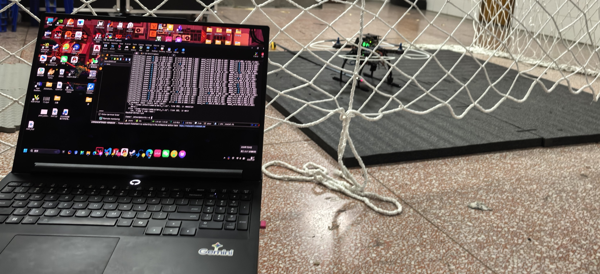
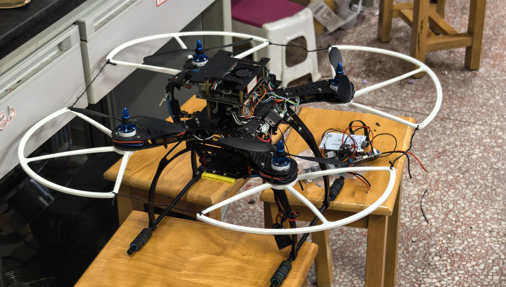
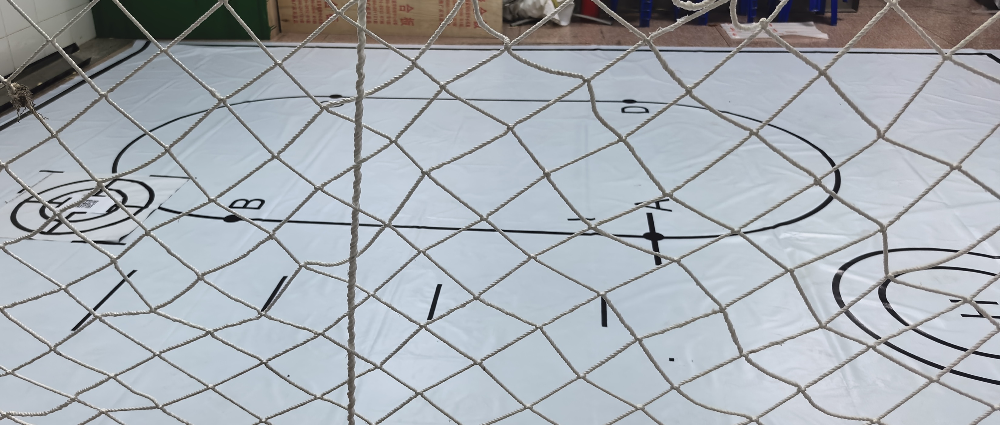

本来这篇是用来写自己的大一结束的总结的，但是我太懒了，光写了个开头就没下文了。从大一总结新建文件夹到写这个电赛回忆录正好一个月，也是很巧了

参加的是26年湖南省电赛D题

---
# 关于电赛
最开始，我了解到电赛应该是在高三结束的暑假，刷抖音刷到一些大学里面很夯的工科竞赛，粗略地了解了一下电赛，最开始更偏向于小车题的，在大一上的时候也是想着会打小车题的。

## 坐牢的无人机
但是在6月初的时候被同学拉去打无人机了，对，六月初，相对于无人机这个赛道来说确实很晚了，但是也有好消息，说有祖传代码，上一届打完的旧无人机还在。当时我想着有祖传代码，还有现成无人机，虽然我们都没有经验，但是站在学长的肩膀上应该不难。哎，天不遂人愿，给我们留下的无人机大部分都坏了，我们也走了一些选材上的弯路，到电赛前不久才开始调试。

其实 我认为没太有必要用遥控器试起飞的（后面会提一下我们无人机的方案），应该尽早地用程序起飞，然后可以早一些调其他地方。早一些用程序起飞也有好处，因为我们被用程序起飞卡了很久，早一些用程序起飞的话就可以早一点发现这个问题。

在比赛前，其实休息还是很重要的，不仅是为了电赛的那四天，而且保证你前期有一个清晰的思路。前期思路没理清的话，电赛那四天会更难搞。那四天真的睡的很少，感觉像生死局.......万幸，福大命大。

我们的飞机在电赛截至前一天的凌晨终于用程序起飞了。我们一开始就打算跑定点，直接把要走的航点写入jetson，然后jetson发速度给飞控，这一套东西不算复杂，所以在封箱前遍历航点还是没问题了，万幸万幸。

---
## 遇到了哪些问题

### 飞控
首先就是用匿名飞控的一键起飞函数起飞，一键起飞顾名思义，应该是一键就能起飞啊，但是我们确实在这卡了很久，后面幸得高人相助，终于 一键起飞成功

还有就是光流反馈的速度不准，（jetson发一个目标速度，飞控通过光流获取一个当前速度，飞控控制飞机跟目标速度。）如果当前速度不准的话，控制就会有问题。它以为它已经达到目标速度了，但是没有。简单说就是我让他往左走，但是它不走，甚至往右去，后面把当前速度的速度源换成t265就好很多，至少大概按我写的点跑的，降落回原点的误差大概在20cm，还能接受。

### jetson
用的是jetson nano 8g，首先就是开机连热点慢，因为我需要用ssh执行我写的东西，然后看终端，所以我每次都要连热点，这玩意重新连一次手机热点是真的慢，稍微运行点东西就过热，然后直接关机了，给我搞懵逼了。我生怕是我搞坏了，哎，万幸万幸，让他休息休息，重新上电，风扇又转了

还有就是t265连接的问题，我不知道为什么，每次jetson重新上电之后，t265也要重新拔插一次，写了一个重连的部分也没用。暂时没解决，就依靠每次都重新插一下。

### 蓝牙
因为赛题要求通过小车启动无人机，我们在小车上有一个蓝牙模块，jetson外接一个usb接ttl然后接蓝牙模块。按小车上的按键然后小车启动，同时通过蓝牙发送信号给无人机，在自己学校的时候都好好的，但是到比赛场地就出问题了，jetson就是接受不到信号，~~所以一定不要用蓝牙啊！！！~~

坏了，错怪蓝牙了 hc12不是蓝牙
hc12频段433MHz 上面还挂了一个匿名数传 2.4g
遥控器的接受机2.4g 我就说怎么遥控器信号这么差呢 和数传一样都是2.4G
但是为什么jetson没收到呢 回学校研究下

---
## 无人机方案
我们采用了
```markdown
匿名凌霄飞控
匿名光流
tfmini（反馈高度数据，这个是真不错）
t265双目相机（反馈x，y轴坐标，当前速度）
jetson nano 8G
usb相机
4s电池
乐天 50A电调（电机不记得）
蓝牙模块（hc12）
usb转ttl
```
~~原来hc12不是蓝牙~~


### 关于无人机的软件层面

写定航点在jetson里面，然后jetson发速度给飞控，飞控执行。我们在小车顶放了一个二维码，理想情况下，飞机飞到定点，小车也差不多过来了，然后启动usb相机识别二维码，得到坐标，然后扔下去东西，或者是降落在小车上

关于jetson部分用的纯py，时间实在不多，而且任务也不算复杂就没上ros。

“人生苦短 我用python” 

## 关于明年
明年是国赛，在湖南这个无人机赛道不算太卷的省份，我个人还是希望能够冲到国赛的。明年装备也需要升级一下，得上mid，上mid的话就得上ros，上ros的话现在的jetson感觉有点撑不住，还得重新买个电脑，这是我个人希望，买不买还得看老师，哎。
然后我们也需要尽早准备，我目前计划的是，回学校之后马上再飞半个月，不改硬件的情况下，然后再在明年三月开始改硬件部分，（都给我上好的！！！），尽量在四月中旬就能改出来，然后能够上手调


## 补充
回到学校之后，重新进行测试。然后发现，匿名数传太强了，会干扰接收机的信号，甚至是hc12的信号(匿名数传是2.4Ghz的，hc12是433.4到473.0mhz)。

比赛的时候我们是忘记拔数传了，导致了信号的传输问题。匿名数传除了可以看飞控上位机的数据之外，还可以当作一个无线串口使用。

血和泪的教训。


## 图片
放几张野生大图，哈哈哈哈，无人机还是很有意思的，哈哈哈哈






终于是写了自己的第二篇blog，哈哈哈哈哈